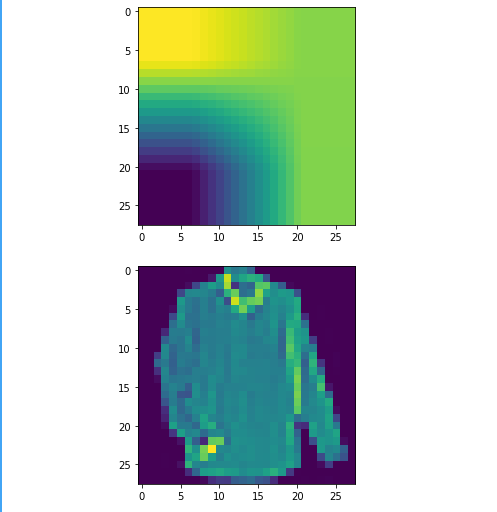

# Implementation of Class activation mapping from the original paper "Learning Deep Features for Discriminative Localization" by Bolei Zhou, Aditya Khosla, Agata Lapedriza, Aude Oliva, Antonio Torralba.

## The goal of this project was to build a Convolutional Neural Network and apply class activation mapping 
## to demonstrate the explainibility power of CNN on FashionMNIST dataset.

## CAM can be improved by improvising the model parameters with lower loss 

### Installation:

    1. Run "pip3 install -r 'requirements.txt'

### How to run:

    1. Run "python3 camnet.py"

